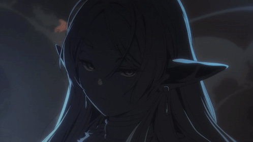

# Olá, eu sou Kauã Porto.

### DESENVOLVEDOR WEB
### Criando experiências digitais, interfaces e projetos que ganham vida.

 

 

   

   

---

## SOBRE MIM

Sou Kauã Porto, desenvolvedor apaixonado por tecnologia e pela criação de experiências digitais. Gosto de transformar ideias em aplicações funcionais, explorar novas ferramentas e evoluir a cada projeto.

- Desenvolvendo projetos web e experiências interativas
- Aprendendo e aprimorando minhas habilidades constantemente
- Interessado em interfaces, automações e soluções criativas
- Aberto a novas ideias, colaborações e desafios

  

> [!IMPORTANT]
> Explore meus **[projetos e repositórios](https://github.com/Ryakira?tab=repositories)** para acompanhar o que estou construindo.

   

   

---

## ARSENAL TECNOLÓGICO

 

   

   

---

## ESTATÍSTICAS

 

  

  

---

### “A evolução começa quando uma ideia se transforma em ação.”

 

  

Kauã Porto · Sempre aprendendo · Sempre construindo

